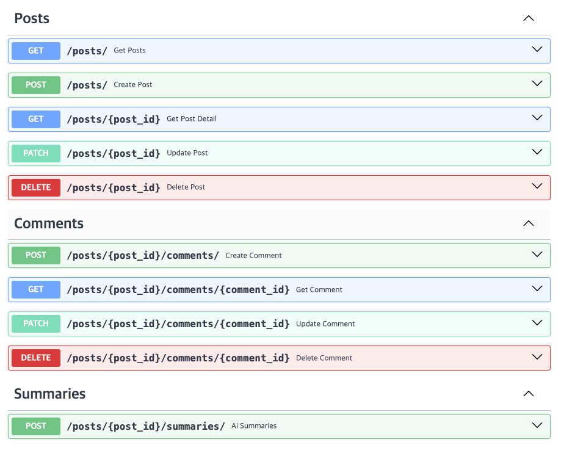
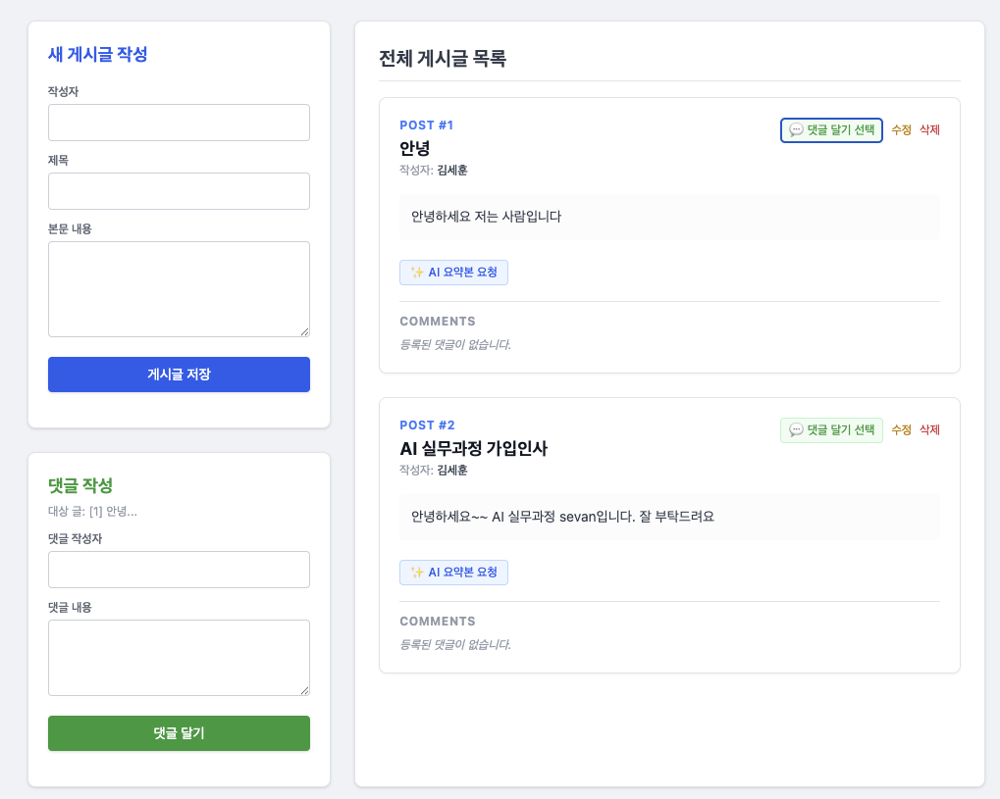

# 사용법
---

## 1) FastAPI

# 1. 가상환경 생성 및 활성화
```bash
# 1. 가상환경 생성 및 활성화
python3 -m venv .venv 
source .venv/bin/activate

# 2. FastAPI 및 실행 라이브러리 설치
pip install fastapi[standard] 

# 3. FastAPI 서버 실행
fastapi dev
```


# 실행 예시
---

## 1) API EndPoint

### 게시글(Posts)

| 메서드 | 경로 | 설명 |
| --- | --- | --- |
| POST | /posts | 게시글 생성 |
| GET | /posts | 게시글 조회 |
| GET | /posts/{post_id} | 특정 게시글 조회 |
| PATCH | /posts/{post_id} | 특정 게시글 수정 |
| DELETE | /posts/{post_id} | 특정 게시글 삭제 |

### 댓글(Comments)

| 메서드 | 경로 | 설명 |
| --- | --- | --- |
| POST | /posts/{post_id}/comments | 댓글 생성 |
| GET | /posts/{post_id}/comments | 댓글 조회 |
| PATCH | /posts/{post_id}/comments/{comment_id} | 특정 댓글 수정 |
| DELETE | /posts/{post_id}/comments/{comment_id} | 특정 댓글 삭제 |

### AI 요약(Summary)

| 메서드 | 경로 | 설명 |
| --- | --- | --- |
| POST | /posts/{post_id}/summaries | 특정 게시글 요약 생성 |

## 2} swagger

---



# 파일 구조

```text
│
├── core/
│   ├── config.py          # 환경 변수 및 글로벌 설정
│   └── database.py        # SQLAlchemy 엔진 및 세션 관리
│
├── models/                # 데이터베이스 은유 계층 (SQLAlchemy ORM)
│   ├── post.py
│   ├── comment.py
│   └── summary.py
│
├── schemas/               # 데이터 검증 계층 (Pydantic DTO)
│   ├── post.py
│   ├── comment.py
│   └── summary.py
│
├── routers/               # 엔드포인트 라우팅 계층 (Controller)
│   ├── posts.py
│   ├── comments.py
│   └── summaries.py
│
├── services/              # 비즈니스 로직 및 외부 연동 (Ollama 등)
│   └── ollama.py
│
└── main.py                # 애플리케이션 진입점 (App 초기화 & 미들웨어)

```

# 게시판 화면
---




# 회고
---

```
FastAPI를 처음 사용해보면서 CRUD 구조를 직접 코딩해보았다. 대강 데이터가 들어오면 DB에서 정보를 가져오고 서버에서 처리하고 다시 브라우저(사용자)로 넘겨주는 건 알고 있었다. 그러나 실제로 어떤 코드로 서버와 연결하는지 데이터는 어떤 코드로 넘기는지 처음 짜볼 수 있었다. 

이후에 DB 연결을 진행하면서도 AI를 이용해서만 코딩해보았지 실제로 한땀한땀 코드를 이해하면서 작성해보는 경험이 되어서 좋았다. 게시판 백엔드를 만드려면 어떤 문법과 코드 구조가 존재하는지 어떤 문법을 알아야하는지 알 수 있었고 다른 어플리케이션을 만들 때에도 자신있게 만들 수 있겠다는 생각을 했다.

```